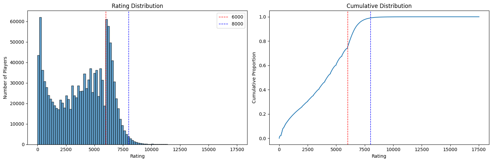

✨ If you enjoy this work and the tool, please consider giving this repository a ⭐!  
A script to look up your rank by username is coming soon.

# 🎮 Hearthstone Battlegrounds – Leaderboard Analysis

> 📊 Dive into the Hearthstone Battlegrounds leaderboard data and uncover player performance insights!

---

## 🚀 Overview

With this repository, you can effortlessly retrieve and analyze leaderboard data from Blizzard’s official site:  
🔗 https://hearthstone.blizzard.com/fr-fr/community/leaderboards/?region=EU&leaderboardId=battlegrounds

- The leaderboard shows top players by **season** and **region** (EU, NA, ASIA).  
- **Currently**, only **Season 3 – EU** data has been collected (see `data/s3/eu/battlegrounds.csv`).  
- Feel free to gather other seasons or regions, but **please do not re-run** the scraper on already-extracted data to avoid overloading Blizzard’s public API.  

---

## 🛠️ Technologies

- **🐍 Python**  
- **🕸️ Scrapy**  
- **🐼 pandas**  
- **📈 matplotlib**

---

## 📥 Data Structure

```

data/
└── s3/eu/battlegrounds.csv     # Season 3 – EU leaderboard export

````

---

## ▶️ Running the Scraper

1. Navigate to the scraper directory:  
   ```bash
   cd hsbg_scraper_leaderboard
    ```

2. Activate your virtual environment and install dependencies:

   ```bash
   python -m venv venv
   source venv/bin/activate      # Windows: venv\Scripts\activate
   pip install -r requirements.txt
   ```
3. Launch the Scrapy spider:

   ```bash
   scrapy crawl leaderboard -o data/s3/eu/battlegrounds.csv
   ```

## 📊 Season 3 EU Analysis

A comprehensive analysis for **Season 3** on the **EU server** has been carried out in the Jupyter notebook [`analysis_hsbg_s3.ipynb`](analysis_hsbg_s3.ipynb). In this notebook, you will find:

- **Key descriptive statistics**: mean, median, first and third quartiles, min/max.
- **Bin‑based distribution**: number and percentage of players per 100‑point rating interval, plus cumulative probabilities.
- **Visualizations**: histogram and cumulative distribution plots.

Below is an example figure from the analysis. You can download the full‑resolution PNG:



[⬇️ Download the figure (PNG)](figures/rating_distribution.png)