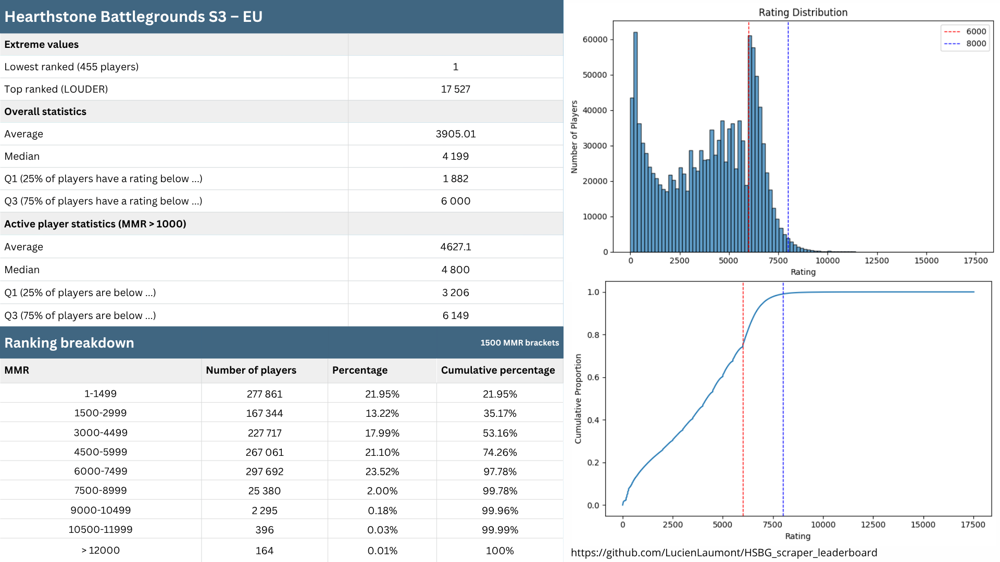
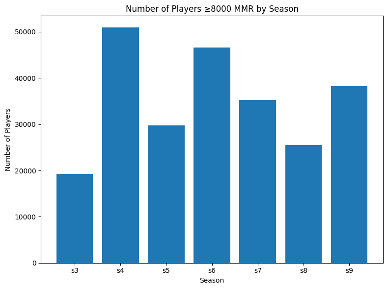
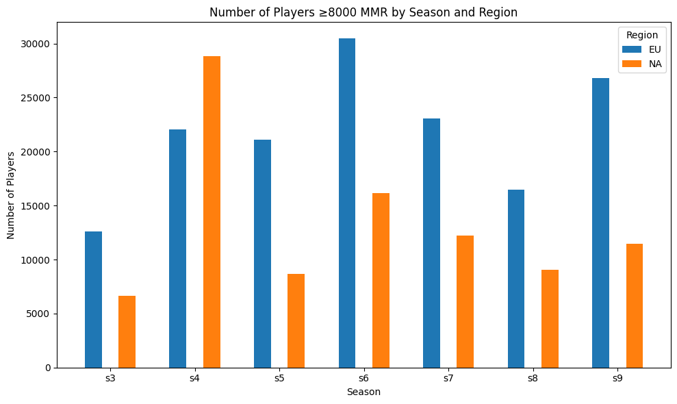
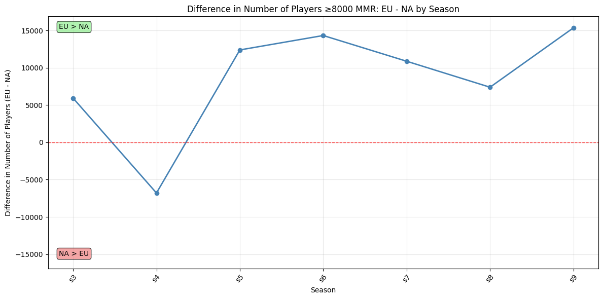
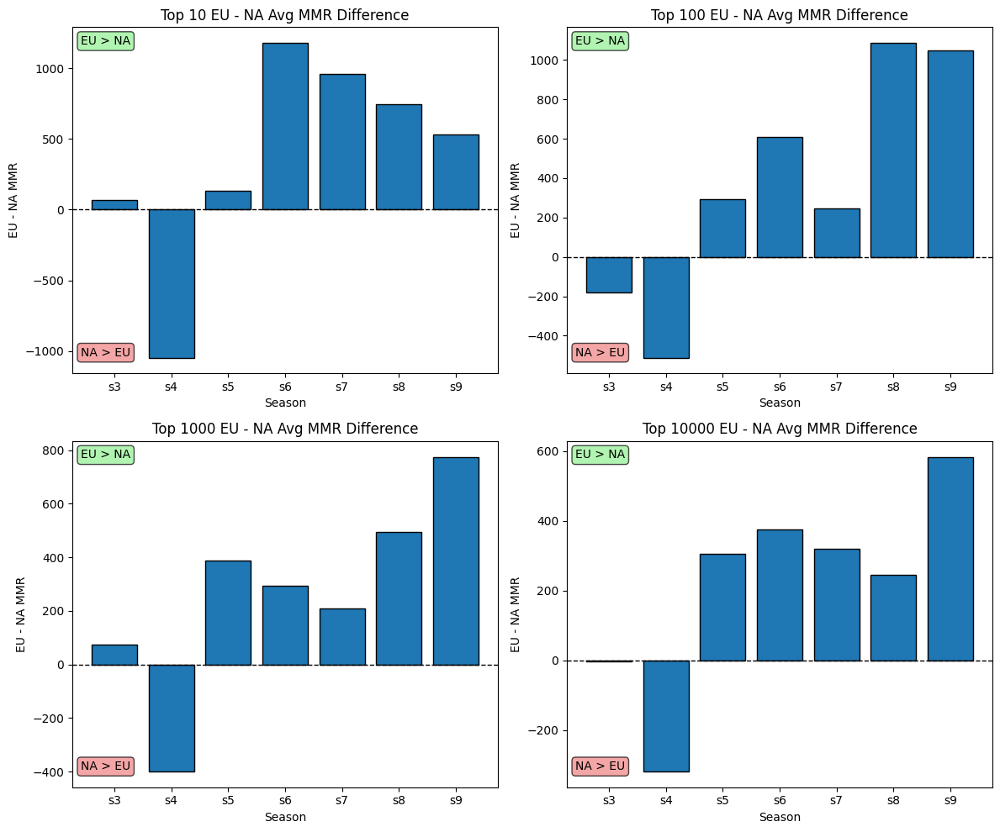

✨ If you enjoy this work and the tool, please consider giving this repository a ⭐!  
A script to look up your rank by username is coming soon.

You can contact me at laumont.lucien@gmail.com

# 🎮 Hearthstone Battlegrounds – Leaderboard Analysis

> 📊 Dive into the Hearthstone Battlegrounds leaderboard data and uncover player performance insights!
> 🚫 The API we used appears to be retrieving incorrect data for the AP leaderboards—particularly for seasons 6 and 7. All the figures are actually based on the EU and NA datasets.

---

## 🚀 Overview

With this repository, you can effortlessly retrieve and analyze leaderboard data from Blizzard’s official site:  
🔗 https://hearthstone.blizzard.com/fr-fr/community/leaderboards/?region=EU&leaderboardId=battlegrounds

- The leaderboard shows top players by **season** and **region** (EU, NA, ASIA).  
- **Currently**, almost every seasons are in the data folder (see [battlegrounds.csv](data/s3/eu/battlegrounds.csv) for the EU-S3 for exemple).  
- Feel free to gather other seasons or regions, but **please do not re-run** the scraper on already-extracted data to avoid overloading Blizzard’s public API.  

---

## 🛠️ Technologies

- **🐍 Python**  
- **🕸️ Scrapy**  
- **🐼 pandas**  
- **📈 matplotlib**

---

## 📥 Data Structure

```

data/
└── s3/eu/battlegrounds.csv     # Season 3 – EU leaderboard export

````

---

## ▶️ Running the Scraper

1. After clonning the project you must enter this command:  
   ```bash
   cd HSBG_scraper_leaderboard
    ```

2. Activate your virtual environment and install dependencies:

   ```bash
   python -m venv venv
   source venv/bin/activate      # Windows: venv\Scripts\activate
   pip install -r requirements.txt
   ```
3. Launch the Scrapy spider:

   ```bash
   cd hsbg_scraper_leaderboard
   scrapy crawl leaderboard_api -o battlegrounds.csv
   ```

## 📊 Season 3 EU Analysis

A comprehensive analysis for **Season 3** on the **EU server** has been carried out in the Jupyter notebook [`analysis_hsbg_s3.ipynb`](analysis_hsbg_s3.ipynb). In this notebook, you will find:

- **Key descriptive statistics**: mean, median, first and third quartiles, min/max.
- **Bin‑based distribution**: number and percentage of players per 100‑point rating interval, plus cumulative probabilities.
- **Visualizations**: histogram and cumulative distribution plots.

Below is an example figure from the analysis. You can download the full‑resolution PNG:

[English version :](figures/HSBG_s3_eu_analysis_EN.png)



## 🆚 All season EU Analysis (Comparison between NA & EU)

In the Jupyter notebook [`evolution_top_leaderboard.ipynb`](evolution_top_leaderboard.ipynb), we performed a focused analysis of Seasons 3–9 to compare the total number of players exceeding 8,000 MMR, evaluate how each region’s player base dominates another, and identify which region appears to reach the highest MMR ceiling.

- **Key focus:** players > 8,000 MMR, inter‑regional dominance, and peak regional MMR cap.








